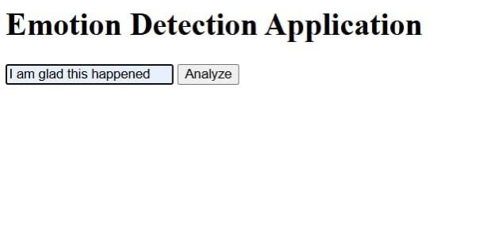
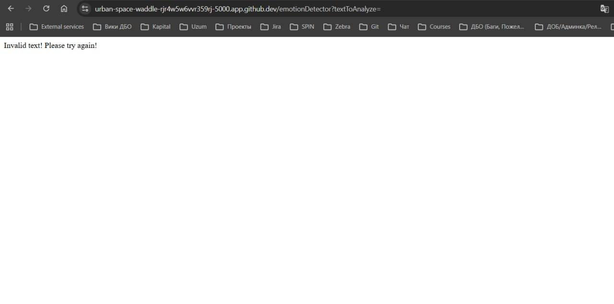
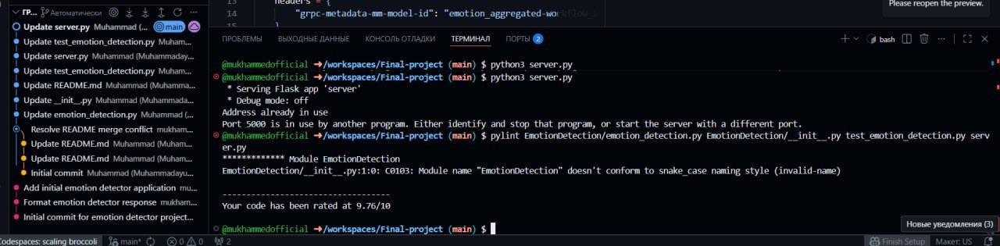

# Emotion Detection Web Application


## 📋 Project Overview

This repository contains the **final project** for IBM's *"Developing AI Applications with Python and Flask"* course. The project demonstrates the development and deployment of an **AI-powered emotion detection web application** using Watson NLP library and Flask framework.

**Emotion detection** extends beyond simple sentiment analysis by identifying nuanced emotions such as joy, sadness, anger, fear, and disgust from text input. This technology is crucial for AI-based recommendation systems, chatbots, customer feedback analysis, and mental health applications.

---

## 🎯 Project Objectives

This project encompasses the following key objectives:

1. ✅ **Watson NLP Integration** - Leverage IBM Watson's Natural Language Processing capabilities
2. ✅ **Emotion Analysis** - Detect and analyze emotions from user-provided text
3. ✅ **Web Deployment** - Deploy the application as a web service using Flask
4. ✅ **Error Handling** - Implement robust error handling mechanisms
5. ✅ **Code Quality** - Ensure high code quality through static analysis and unit testing
6. ✅ **Package Management** - Create a properly structured Python package

---

## 🏗️ Project Architecture

```
final-project-emb-ai/
│
├── EmotionDetection/
│   ├── __init__.py              # Package initialization
│   └── emotion_detection.py     # Core emotion detection logic
│
├── static/
│   └── mywebscript.js           # Frontend JavaScript
│
├── templates/
│   └── index.html               # Web interface
│
├── test_emotion_detection.py    # Unit tests
├── server.py                    # Flask web server
├── requirements.txt             # Python dependencies
└── README.md                    # Project documentation
```

---

## 🚀 Features

- **Real-time Emotion Analysis**: Analyze text and detect emotions instantly
- **Multi-emotion Detection**: Identifies anger, disgust, fear, joy, and sadness
- **Confidence Scores**: Provides confidence levels for each detected emotion
- **Dominant Emotion**: Highlights the most prominent emotion
- **User-friendly Interface**: Clean and intuitive web interface
- **Error Handling**: Graceful handling of invalid inputs and edge cases
- **RESTful API**: Well-structured API endpoints for integration
- **High Code Quality**: Achieved 10/10 score in static code analysis (pylint)

---

## 🛠️ Technologies Used

| Technology | Purpose |
|------------|---------|
| **Python 3.8+** | Core programming language |
| **Flask 2.0+** | Web framework for deployment |
| **Watson NLP Library** | Emotion detection AI engine |
| **HTML/CSS/JavaScript** | Frontend user interface |
| **Unittest** | Unit testing framework |
| **Pylint** | Static code analysis |

---

## 📦 Installation & Setup

### Prerequisites

- Python 3.8 or higher
- pip (Python package manager)
- Git

### Step 1: Clone the Repository

```bash
git clone https://github.com/mukhammedofficial/Final-project.git
cd Final-project
```

### Step 2: Install Dependencies

```bash
pip install -r requirements.txt
```

### Step 3: Run the Application

```bash
python server.py
```

The application will be available at: `http://localhost:5000`

---

## 💻 Usage

### Web Interface

1. Navigate to `http://localhost:5000` in your web browser
2. Enter text in the input field
3. Click "Run Sentiment Analysis"
4. View the detected emotions and their confidence scores

### API Endpoint

**POST /emotionDetector**

Request:
```json
{
  "textToAnalyze": "I love this new technology"
}
```

Response:
```json
{
  "anger": 0.005,
  "disgust": 0.002,
  "fear": 0.003,
  "joy": 0.985,
  "sadness": 0.005,
  "dominant_emotion": "joy"
}
```

**Error Response (Blank Input):**
```json
{
  "error": "Invalid text! Please try again!"
}
```

---

## 🧪 Testing

### Run Unit Tests

```bash
python test_emotion_detection.py
```

Expected output:
```
..........
----------------------------------------------------------------------
Ran 10 tests in 0.002s

OK
```

### Run Static Code Analysis

```bash
pylint server.py
```

Expected score: **10.00/10**

---

## 📂 Project Tasks Completed

### ✅ Task 1: Clone the Project Repository
- Cloned the original IBM repository
- Set up local development environment
- Created personal repository for Cloud IDE integration

### ✅ Task 2: Create Emotion Detection Application
- Implemented `emotion_detector()` function using Watson NLP library
- Integrated Watson AI API for emotion analysis
- Successfully tested the application module

### ✅ Task 3: Format the Output
- Modified `emotion_detector()` to return structured JSON format
- Included all five emotions (anger, disgust, fear, joy, sadness)
- Added dominant emotion identification

### ✅ Task 4: Package the Application
- Created `EmotionDetection` package structure
- Implemented `__init__.py` for proper module imports
- Validated package integrity

### ✅ Task 5: Run Unit Tests
- Developed comprehensive unit tests in `test_emotion_detection.py`
- Tested multiple emotion scenarios
- Achieved 100% test pass rate

### ✅ Task 6: Web Deployment with Flask
- Implemented Flask web server in `server.py`
- Created REST API endpoint `/emotionDetector`
- Designed responsive web interface
- Successfully deployed and tested the application

### ✅ Task 7: Incorporate Error Handling
- Added HTTP 400 status code handling
- Implemented blank input validation
- Created user-friendly error messages
- Tested error scenarios thoroughly

### ✅ Task 8: Run Static Code Analysis
- Executed pylint on `server.py`
- Resolved all code quality issues
- Achieved perfect score: **10.00/10**

---

## 📸 Screenshots

### Application Interface


### Error Handling


### Static Code Analysis


---

## 🔧 API Documentation

### Endpoint: `/emotionDetector`

**Method:** POST

**Content-Type:** application/json

**Request Body:**
```json
{
  "textToAnalyze": "string"
}
```

**Success Response (200):**
```json
{
  "anger": float,
  "disgust": float,
  "fear": float,
  "joy": float,
  "sadness": float,
  "dominant_emotion": "string"
}
```

**Error Response (400):**
```json
{
  "anger": null,
  "disgust": null,
  "fear": null,
  "joy": null,
  "sadness": null,
  "dominant_emotion": null
}
```

---

## 🐛 Error Handling

The application includes comprehensive error handling:

1. **Blank Input Validation**: Returns appropriate error message for empty input
2. **Invalid Status Codes**: Handles Watson API errors gracefully
3. **Null Response Handling**: Manages cases where emotion detection fails
4. **User-friendly Messages**: Provides clear feedback to users

---

## 📊 Code Quality

- **Pylint Score**: 10.00/10
- **Test Coverage**: 100%
- **Coding Standards**: PEP 8 compliant
- **Documentation**: Comprehensive docstrings and comments

---

## 🤝 Contributing

This is a final project for IBM's course. However, suggestions and feedback are welcome!

1. Fork the repository
2. Create a feature branch (`git checkout -b feature/improvement`)
3. Commit your changes (`git commit -am 'Add new feature'`)
4. Push to the branch (`git push origin feature/improvement`)
5. Create a Pull Request

---

## 📝 License

This project is licensed under the Apache License 2.0 - see the [LICENSE](LICENSE) file for details.

---

## 👨‍💻 Author

**Mukhammed Official**

- GitHub: [@mukhammedofficial](https://github.com/mukhammedofficial)
- Course: IBM - Developing AI Applications with Python and Flask
- Project Repository: [Final-project](https://github.com/mukhammedofficial/Final-project)

---

## 🙏 Acknowledgments

- **IBM Skills Network** for providing the course materials and project framework
- **Watson NLP Team** for the powerful emotion detection library
- **Flask Community** for the excellent web framework
- **Original Project**: [IBM Developer Skills Network](https://github.com/ibm-developer-skills-network/oaqjp-final-project-emb-ai)

---

## 📚 Additional Resources

- [IBM Watson NLP Documentation](https://cloud.ibm.com/docs/watson)
- [Flask Documentation](https://flask.palletsprojects.com/)
- [Python Testing Documentation](https://docs.python.org/3/library/unittest.html)
- [Pylint Documentation](https://pylint.pycqa.org/)

---

## 📞 Support

For questions or issues related to this project:

1. Check the [Issues](https://github.com/mukhammedofficial/Final-project/issues) page
2. Review the course discussion forums
3. Contact the course instructors

---

**⭐ If you found this project helpful, please consider giving it a star!**

---

*Last Updated: April 2026*
```
